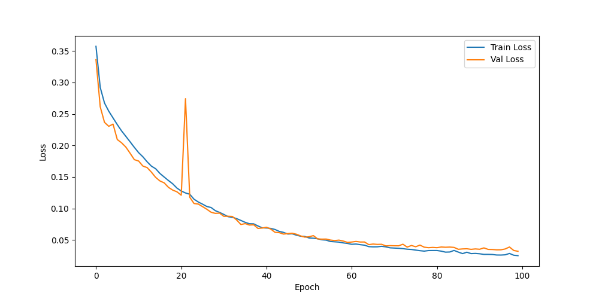

# PALM Medical Image Segmentation

This project implements a U-Net based deep learning model for segmenting medical images from the PALM (Pathological Myopia) dataset. The model is designed to detect and segment three key features: Atrophy, Detachment, and Optic Disc regions in retinal images.

## Dataset: PALM (Pathological Myopia)

The PALM dataset consists of retinal images with corresponding segmentation masks for three different features:

1. **Atrophy Masks**: Areas of retinal atrophy
2. **Detachment Masks**: Regions of retinal detachment
3. **Disc Masks**: Optic disc regions

The dataset is split into training and validation sets, with the following structure:
```
PALM/
├── Training/
│   ├── Images/
│   ├── Lesion Masks/
│   │   ├── Atrophy/
│   │   └── Detachment/
│   └── Disc Masks/
└── Validation/
    ├── Images/
    ├── Lesion Masks/
    │   ├── Atrophy/
    │   └── Detachment/
    └── Disc Masks/
```

## Model Architecture

The project uses a U-Net architecture, which is particularly effective for medical image segmentation tasks. The architecture combines an encoder path for feature extraction and a decoder path for precise localization.


Key Features:
- **Encoder Path**: Progressive downsampling (64→128→256→512→1024 features)
- **Decoder Path**: Progressive upsampling with skip connections
- **DoubleConv Blocks**: Two 3x3 convolutions with batch normalization and ReLU
- **Skip Connections**: Preserve fine-grained details
- **Final Layer**: 1x1 convolution with sigmoid activation

## Training Methodology

### Deep Learning Approach
The project employs a U-Net architecture, which is specifically designed for biomedical image segmentation. The architecture combines:
- **Encoder Path**: Progressive downsampling to capture context and extract features
- **Decoder Path**: Progressive upsampling to recover spatial information
- **Skip Connections**: Direct connections between encoder and decoder to preserve fine-grained details

Key architectural features:
- **Double Convolution Blocks**: Each block contains two 3x3 convolutions with batch normalization and ReLU activation
- **Max Pooling**: 2x2 pooling for downsampling in the encoder
- **Transposed Convolutions**: 2x2 upsampling in the decoder
- **Skip Connections**: Concatenation of encoder features with decoder features
- **Final Layer**: 1x1 convolution with sigmoid activation for multi-class segmentation

### Data Preprocessing and Augmentation
1. **Image Resizing**:
   - All images are standardized to 256x256 pixels
   - Maintains aspect ratio during resizing
   - Uses bilinear interpolation for images
   - Uses nearest-neighbor interpolation for masks

2. **Data Augmentation Pipeline**:
   ```python
   train_transform = A.Compose([
       A.HorizontalFlip(p=0.5),
       A.VerticalFlip(p=0.5),
       A.RandomRotate90(p=0.5),
       A.Normalize(mean=[0.485, 0.456, 0.406], std=[0.229, 0.224, 0.225]),
       ToTensorV2(),
   ])
   ```
   - **Spatial Augmentations**:
     - Horizontal and vertical flips (50% probability)
     - 90-degree rotations (50% probability)
   - **Normalization**:
     - Uses ImageNet statistics for standardization
     - Helps with model convergence and generalization

### Loss Function
The project implements a custom Weighted Binary Cross-Entropy Loss:
```python
class WeightedBCELoss(nn.Module):
    def __init__(self, missing_weight=0.0):
        super().__init__()
        self.missing_weight = missing_weight
        self.bce = nn.BCELoss(reduction='none')
    
    def forward(self, pred, target, mask_exists):
        loss = self.bce(pred, target)
        weights = mask_exists.float() + (~mask_exists).float() * self.missing_weight
        weighted_loss = (loss * weights).mean()
        return weighted_loss
```

Key features:
- Handles missing masks in the dataset
- Configurable weights for missing data
- Supports multi-class segmentation
- Maintains gradient flow for all classes

### Training Process
1. **Optimization Strategy**:
   - Optimizer: Adam
   - Learning Rate: 1e-4
   - Batch Size: 16
   - Number of Epochs: 100

2. **Training Loop**:
   ```python
   for epoch in range(num_epochs):
       train_loss = train_model(model, train_loader, criterion, optimizer, device)
       val_loss = validate_model(model, val_loader, criterion, device)
       
       if val_loss < best_val_loss:
           best_val_loss = val_loss
           torch.save(model.state_dict(), "best_model.pth")
   ```

3. **Model Checkpointing**:
   - Saves best model based on validation loss
   - Prevents overfitting
   - Enables model recovery

### Training Monitoring and Visualization
1. **Loss Tracking**:
   - Real-time training loss monitoring
   - Validation loss computation
   - Automatic loss curve generation

2. **Visualization Tools**:
   ```python
   plt.figure(figsize=(10, 5))
   plt.plot(train_losses, label='Train Loss')
   plt.plot(val_losses, label='Val Loss')
   plt.xlabel('Epoch')
   plt.ylabel('Loss')
   plt.legend()
   plt.savefig('training_progress.png')
   ```

3. **Performance Metrics**:
   - Training loss convergence
   - Validation loss monitoring
   - Segmentation quality assessment

4. **Sample Training Results**:
   The following plot shows the training and validation loss curves over 100 epochs:

   

   The plot demonstrates:
   - Convergence of both training and validation losses
   - No significant overfitting (validation loss follows training loss)
   - Stable learning process

### Hardware Acceleration
The model supports multiple hardware backends:
- CUDA for NVIDIA GPUs
- MPS (Metal Performance Shaders) for Apple Silicon
- CPU fallback for other systems

### Hyperparameter Tuning
Key hyperparameters that can be adjusted:
- Learning rate (default: 1e-4)
- Batch size (default: 16)
- Number of epochs (default: 100)
- Missing mask weight (default: 0.0)
- Data augmentation probabilities

## Requirements

- Python 3.x
- PyTorch
- torchvision
- albumentations
- numpy
- PIL
- matplotlib
- tqdm

## Usage

1. Prepare your dataset in the PALM directory structure
2. Install required dependencies
3. Run the training script:
```bash
python train.py
```

The training process will:
- Save the best model as `best_model.pth`
- Generate training progress plots as `training_progress.png`

## Model Performance

The model's performance is evaluated using:
- Training loss
- Validation loss
- Visual inspection of segmentation results

The training progress is automatically plotted and saved, showing the convergence of both training and validation losses over time.

## License

This project is licensed under the MIT License with a non-commercial clause. See the [LICENSE](LICENSE) file for details.

### License Terms

```
MIT License with Non-Commercial Clause

Copyright (c) 2025 [Nguyen Tran Dinh Khoi]

Permission is hereby granted, free of charge, to any person obtaining a copy
of this software and associated documentation files (the "Software"), to deal
in the Software for non-commercial purposes, including without limitation the rights
to use, copy, modify, merge, publish, distribute, sublicense, and/or sell copies
of the Software for educational and research purposes, subject to the following conditions:

1. The above copyright notice and this permission notice shall be included in all
   copies or substantial portions of the Software.

2. The Software may not be used for commercial purposes without explicit written
   permission from the copyright holder.

THE SOFTWARE IS PROVIDED "AS IS", WITHOUT WARRANTY OF ANY KIND, EXPRESS OR
IMPLIED, INCLUDING BUT NOT LIMITED TO THE WARRANTIES OF MERCHANTABILITY,
FITNESS FOR A PARTICULAR PURPOSE AND NONINFRINGEMENT. IN NO EVENT SHALL THE
AUTHORS OR COPYRIGHT HOLDERS BE LIABLE FOR ANY CLAIM, DAMAGES OR OTHER
LIABILITY, WHETHER IN AN ACTION OF CONTRACT, TORT OR OTHERWISE, ARISING FROM,
OUT OF OR IN CONNECTION WITH THE SOFTWARE OR THE USE OR OTHER DEALINGS IN THE
SOFTWARE.
```

This license allows you to:
- Use the code for learning and research
- Modify and distribute the code for non-commercial purposes
- Share your modifications with others
- Use the code in academic settings

While restricting:
- Commercial use without explicit permission
- Redistribution for commercial purposes

## Citation

If you use this code in your research or learning, please cite:

```
@software{palm_segmentation_2025,
  author = {Nguyen Tran Dinh Khoi},
  title = {PALM Medical Image Segmentation},
  year = {2025},
  url = {https://github.com/yourusername/palm-train},
  note = {A U-Net based deep learning model for segmenting medical images from the PALM dataset}
}
```

For BibTeX format:
```bibtex
@software{palm_segmentation_2025,
  author = {Nguyen Tran Dinh Khoi},
  title = {PALM Medical Image Segmentation},
  year = {2025},
  url = {https://github.com/yourusername/palm-train},
  note = {A U-Net based deep learning model for segmenting medical images from the PALM dataset}
}
```

For APA format:
```
Nguyen Tran Dinh Khoi. (2025). PALM Medical Image Segmentation [Computer software]. https://github.com/yourusername/palm-train
```

For MLA format:
```
Nguyen Tran Dinh Khoi. "PALM Medical Image Segmentation." Computer software. 2025. https://github.com/yourusername/palm-train
``` 